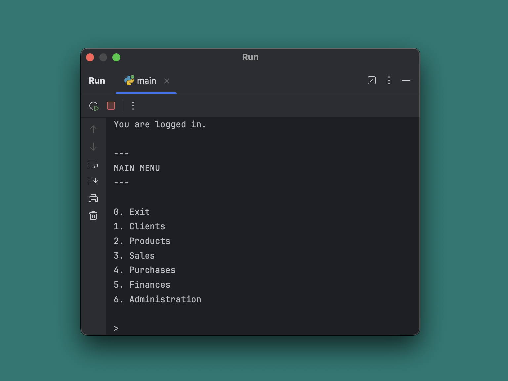
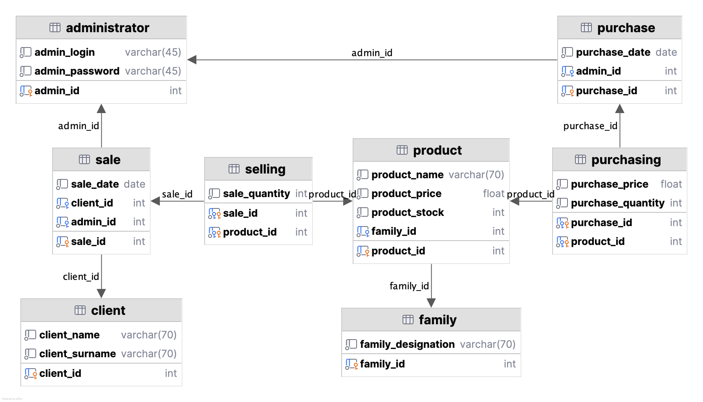

# Sales-Python

This program is my third personal project 
as part of my learning journey in Python and SQL.



---
## Modules

1. [Database connection](src/modules/module_db_connection.py)
2. [Login](src/modules/module_login.py)
3. [Main menu](main.py)
4. [Clients](src/modules/module_clients.py)
   - Add a client
   - Delete a client
   - List all clients
5. [Products](src/modules/module_products.py)
   - Add a product
   - Delete a product
   - Add a product family
   - Delete a product family
   - List products by family
6. [Sales.py](src/modules/modules_sales.py)
   - Sell
   - Statistics
     - Sales by product
     - Sales by client
     - Sales by administrator
7. [Purchases](src/modules/module_purchases.py)
8. [Finances](src/modules/module_finances.py)
   - Show revenue by month
   - Show revenue by year 
9. [Administration](src/modules/module_administration.py)
   - Add a user
   - Delete a user
   - Change a user's password

---
## Project structure

The modules use common functions stored and organized in 
the [functions](src/functions) package, and SQL queries 
located in [queries](src/queries).

---
## Database

The database runs on MySQL 8.0.

### Relational diagram
- `client` (_client_id_, client_name, client_surname)
- `administrator` (_admin_id_, admin_login, admin_password)
- `family` (_family_id_, family_designation)
- `product` (_product_id_, product_designation, product_price, product_stock, #family_id)
- `sale` (_sale_id_, sale_date, #admin_id)
- `selling` (#_sale_id_, #_product_id_, sale_quantity)
- `purchase` (_purchase_id_, purchase_date, #admin_id)
- `purchasing` (#_purchase_id_, #_product_id_, purchase_quantity)

### Database diagram



---
## How to try the program

1. Follow the instructions in [db_creation.sql](docs/db_creation.sql) 
script to create the database on your own MySQL instance.

2. Install Python and the MySQL connector on your computer:

```bash
pip install -r requirements.txt
```

3. Completes the database configuration file with the details
of your MySQL instance.